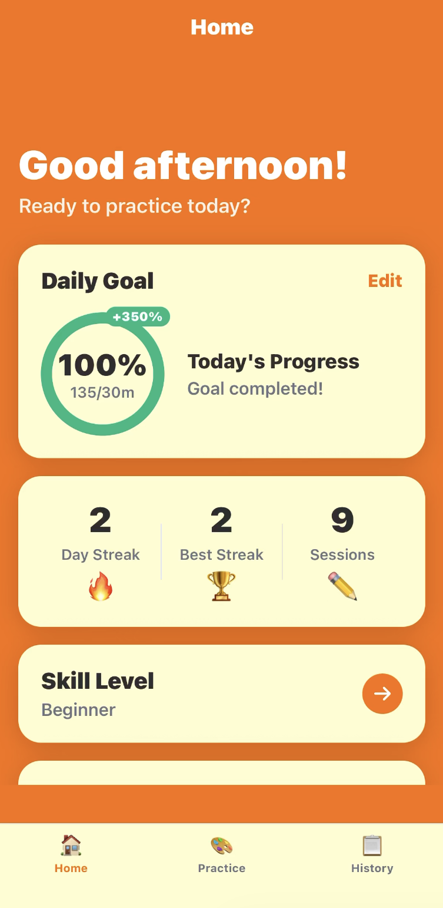

# AI Art Tutor

> An AI-powered mobile atelier that meets students where they are, and evolves with them.


<a href="https://youtube.com/shorts/k1mgirOuqs8?si=7tFOKUFaem6yNwNA">
  
</a>
<p align="center"><em>Click on the image to watch the demo!</em></p>

---

## Why I Built This

I recently started learning to draw and paint. I quickly found a wall in my progress, not because of a lack of content available on the internet, but because of an overwhelming pool of resources, a lack of structure, and no personalized feedback.

I believe one of the most important potentials of AI is to act as a personalized teacher that can meet anybody at their knowledge level and teach them almost anything. I wanted to build a system that uses computer vision to look at a user's drawings, diagnose what's technically wrong, and explain how to improve with actionable insights.

---

## How I Built This

I started with a simple prompt covering the major details of the app, not filled with specifics, but focused on getting the basics working first. Once the foundation was in place, I manually added API keys, adjusted small details, and shaped the UI to match my vision, using OpenCode to fix bugs and refine behavior along the way.

This project took several hours and required many iterations. After every round, I would review the entire app and describe everything that needed to change in detail.

A concrete example: the reference images fetched from Unsplash were initially useless for drawing practice, too abstract, too painterly, too noisy. I fixed this thinking about how my app works and prompting OpenCode to use a filtered query on Unsplash.

```typescript
const query = `${levelKeyword} isolated on white background -abstract -painting`;
```

The fix took one line, but it required correctly diagnosing *where* the system was failing before asking for/writing anything.

---

## What I Learned About AI Coding Tools

**Define behavior, not features.**
Vague prompts produce vague code. The quality of AI output scales directly with the specificity of the constraint. Every time I ran OpenCode, I checked the app thoroughly and explained in detail what needed to change. I had a clear picture of how the program should look and behave from the beginning, down to the tab structure and color palette.

**Architecture cannot be delegated.**
When the Home screen and Practice screen fell out of sync (level changes on one not reflecting on the other) the fix wasn't a prompt adjustment. It required thinking through the problem, designing a global state provider, and rebuilding the data pipeline. The AI is fast at implementing structure. It cannot invent structure it was never given. A developer needs to think about architecture before writing any code or prompting an AI to write it.

---

## Product Thinking

**AI as augmentation, not replacement.** The goal is not to draw for the user. It is to develop their eye, to give them vocabulary and diagnostic tools they haven't built yet.

**Level-aware feedback.** A beginner and an advanced student looking at the same drawing need completely different feedback. Skill level is a first-class input that changes the model's vocabulary, scrutiny, and expectations.

| Level | Voice | Focus | Terminology |
|-------|-------|-------|-------------|
| Beginner | Encouraging, simple | Big shapes, basic proportions | shapes, lines, outline, light source |
| Intermediate | Constructive, educational | Values, negative space, contour | values, perspective, lost edges, form |
| Advanced | Professional, critical | Anatomical accuracy, atmospheric depth | chiaroscuro, anatomical landmarks, core shadows |

**Tight feedback loop.** Draw → upload → analyze → improve.

---

## Features

**Two practice tracks**
- Free Expression: generates level-appropriate creative prompts, or allows the user to draw what they want and declare what they're doing for adapted AI feedback.
- Daily Challenge: fetches a studio-quality reference image and uses computer vision to compare the user's sketch against it directly.

**Structured critique**
The model evaluates across four explicit dimensions: Proportions, Value and Shading, Composition, Line Quality. This produces consistent, actionable feedback rather than general encouragement.

**Learning Journal**
Every session is logged locally with manual time-tracking. History surfaces recurring weaknesses across sessions.

---

## Tech Stack

| Layer | Technology | Rationale |
|---|---|---|
| Frontend | React Native + Expo | Cross-platform, fast iteration |
| Styling | Tailwind CSS | Consistent design system |
| AI / Vision | Groq — Llama 4 Scout | Lowest-latency vision inference |
| Images | Unsplash API | Filterable, high-quality references |
| Persistence | AsyncStorage | Local-first, no backend dependency at MVP |

---

## Getting Started

```bash
git clone https://github.com/ninapy/AI-Art-Tutor.git
cd AI-Art-Tutor
npm install
```

Add to `.env`:
```
EXPO_PUBLIC_GROQ_API_KEY=your_groq_key
EXPO_PUBLIC_UNSPLASH_ACCESS_KEY=your_unsplash_key
```

```bash
npx expo start
```

Scan the QR code with Expo Go on iOS or Android.

---

## Project Structure

```
ai-art-tutor/
├── app/                      # Expo Router screens
│   ├── _layout.tsx          # Root layout
│   └── (tabs)/              # Tab navigation
│       ├── _layout.tsx      # Tab bar configuration
│       ├── index.tsx        # Home (progress ring, stats)
│       ├── practice.tsx      # Practice (mode selection, upload, AI feedback)
│       └── history.tsx      # History (learning journal)
├── components/               # Reusable UI components
│   ├── GlassCard.tsx        # Glassmorphism card
│   ├── ProgressRing.tsx     # SVG progress indicator
│   ├── CountdownTimer.tsx   # Practice timer
│   └── SessionCompleteModal.tsx  # Manual time entry
├── context/                  # Global state management
│   └── AppContext.tsx       # Skill level, progress, history
├── services/                 # API integrations
│   ├── api.ts               # Unsplash, Groq AI, AsyncStorage
│   └── types.ts             # TypeScript interfaces
├── constants/                # App constants
│   └── theme.ts             # Colors, skill levels, prompts
├── .env                     # API keys (not committed)
├── .env.example             # Template for .env
└── package.json
```

---

## Roadmap

- Cloud persistence via Firebase for cross-device sync
- Community challenges with weekly prompts
- Automatic video tutorial linking based on identified weaknesses
- Progress tracking across critique dimensions over time

---

## What I Took Away

Working with AI coding tools is a design problem, not a prompting problem. Output quality is heavily determined by the clarity of the specification: the architecture, the constraints, the edge cases, the failure modes. Once those are defined, AI becomes a fast executor of ideas that leverages human creativity rather than replacing it.

---

# Contact

email: nina_py_brozovich@brown.edu
